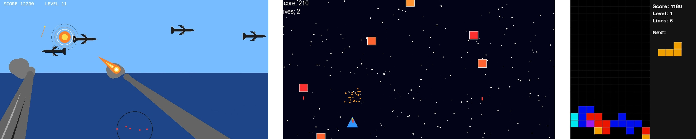

# 🐍 My Python & Pygame Games – Simple, fast & addictive!

Welcome! I am not a professional developer, but an enthusiastic hobby coder. Together with **ChatGPT**, I quickly created a few simple but extremely engaging games using **Python and Pygame**. 

If you don't feel like dealing with complicated giant projects and are looking for **understandable code with a real addictive factor**, you've come to the right place!

---

## 🎬 Watch exciting videos on TikTok
Visit me on TikTok for gameplay videos and updates:
👉 **[www.tiktok.com/@scapaflow69]**

---

## 📸 Screenshots & Gameplay



*(Tip: In this repository, you will also find `.jpg` screenshots and short `.mp4` videos of the individual games!)*

---

## 🚀 What to expect here:
* **Simple & clean code:** Perfect for looking at, understanding, and learning on your own.
* **Instant gameplay:** No long onboarding – start right away and have fun!
* **Retro feeling & addictive factor:** Games that just feel good (look & feel).
* **Endless fun:** The games are intentionally programmed so that you can theoretically play them endlessly.

## 🎮 The games in the repository:
* **2 Action Shooters:** Fast action, simple controls, highscore potential, and maximum action.
* **1 Tetris Clone:** The absolute classic in its own design. I am particularly proud of the animated score display here (thanks to ChatGPT!).
* **Slot Machine:** And of course, my newest baby, a "gambling machine" with special features.
---

## 🛠️ Quick Start

1. **Download the code:** Clone the repository or copy the code of the games.
2. **Install Pygame:** Open your terminal/command prompt and enter the following:
   ```bash
   pip install pygame
   ```
3. **Start the game:** Run the desired Python file and get started!

### 🕹️ Controls:
* **Arrow Keys:** Movement / Steering
* **Spacebar:** Shoot (Shooter) or fast drop (Tetris)
* **ESC Key:** Quit the game immediately at any time

---

## ⭐ Support & Feedback
**Do you like the look & feel?** 
If you try out the code and have fun with it, feel free to leave a **Star (⭐)** here on GitHub!

---

## 👤 Author

* **scapaf64-prog** - *Initial work & Idea*
* *Supported by ChatGPT* 😉
